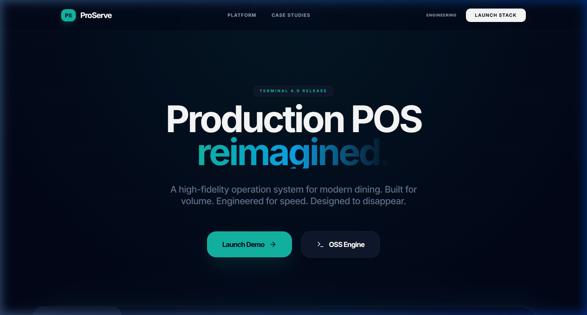
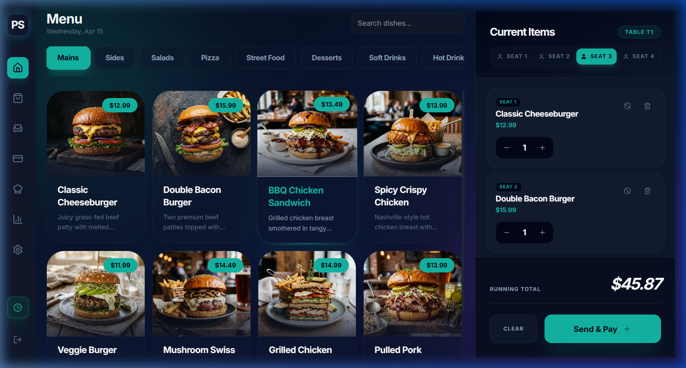
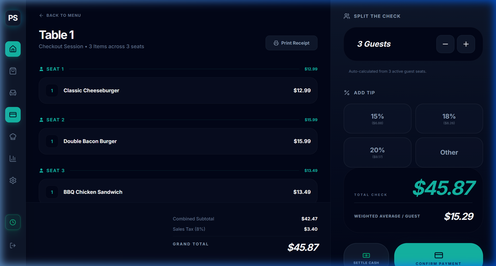
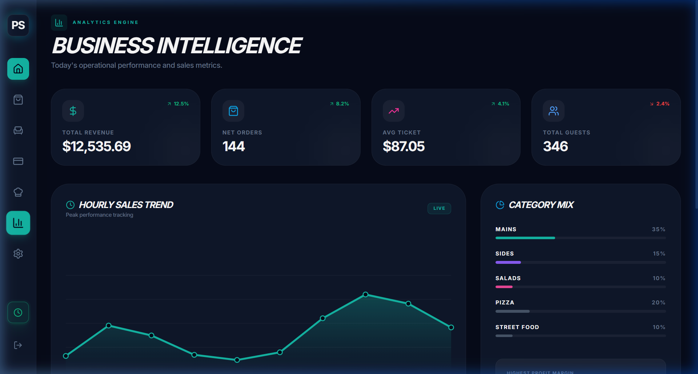
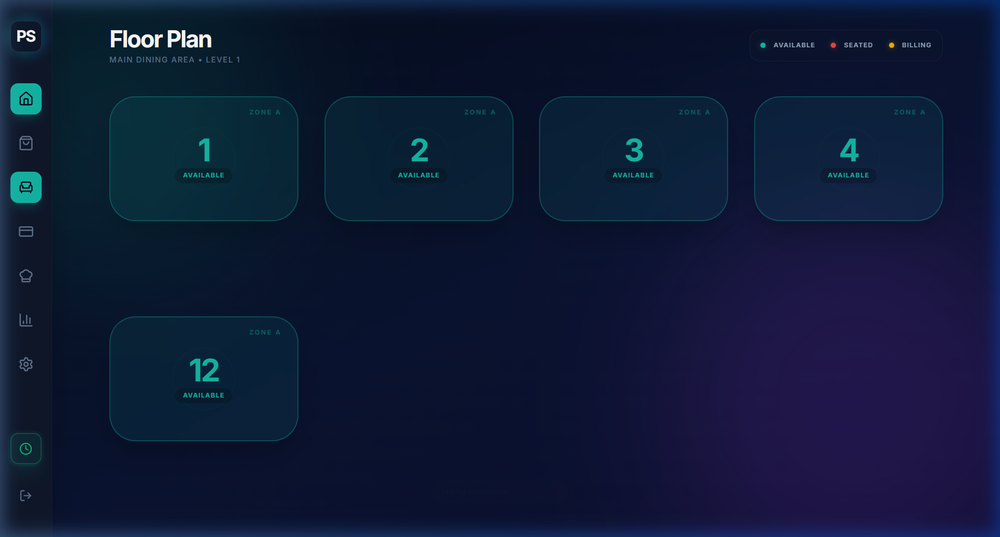
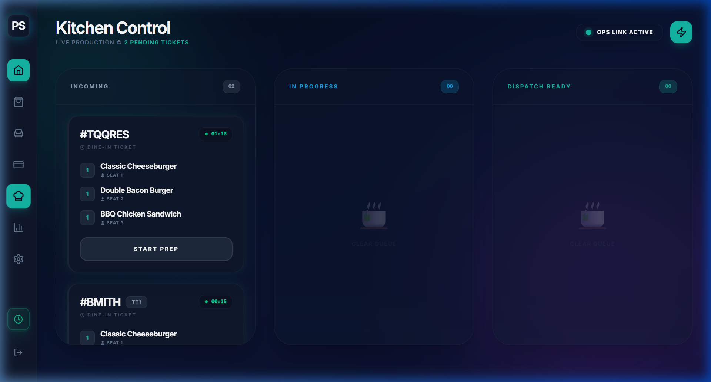

<div align="center">
  
  <h1>ProServe POS</h1>
  <p><strong>Restaurant Operations System</strong></p>
  <p><em>A modern, multi-screen point-of-sale system designed to simulate real-world ordering, kitchen workflows, and business intelligence.</em></p>
  <br/>
  <a href="https://github.com/Alysha93/ProServe-POS-System"></a>
  
  
  
</div>


## 📸 System Showcase

### 🏠 Production Landing — High-Fidelity Entry


### 🛒 Advanced Ordering — Guest Seat Assignments (Seats 1-4)


### 💳 Precision Checkout — Grouped by Seat


### 📊 Business Intelligence — Live Analytics & Trends


### 🗺️ Floor Plan — Interactive Table Management


### 🍳 Kitchen Display — Real-time Production Prep


---

## ⚡ Features

| Feature | Description |
|---|---|
| **Seat Assignments** | NEW: Assign any menu item to specific guests (Seat 1-4) for precise ordering. |
| **Grouped Checkout** | NEW: Automated bill grouping by seat with split-check weighted averages. |
| **Real-Time Analytics** | NEW: Business Intelligence dashboard with hourly sales trends and category mix. |
| **Real-Time Order Sync** | POS → Kitchen via Zustand global state. Zero latency, zero backend. |
| **Kitchen Display (KDS)** | 3-column live board with ⏱ per-order timers & urgency glow (green→yellow→red). |
| **Staff Shift Management** | Clock In/Out enforcement — orders are locked until a staff member is on-shift. |
| **Multi-Screen Workflow** | POS, Takeout, Kitchen, and Tables operate as independent synchronized views. |
| **Table Management** | Interactive drag-capable floor map — Available → Seated → Checkout → Clear. |
| **Promo Engine** | Live discount codes (`PROSERVE10`, `ELITE20`) with real-time total recalculation. |
| **Print Receipts** | `@media print` CSS generates clean paper-ready bills. |
| **Dynamic Takeout UI** | Full-bleed hero banners, category filter pills, cart drawer, and premium grid. |

---

## 🧠 What Makes This Different

> Built with a focus on **real product workflows** rather than static UI demos.
>
> Every screen is interconnected. Adding an order on the POS immediately appears in the Kitchen Display. Completing an order in the Kitchen updates the table status. The system behaves like a real deployed product.

---

## 🚀 Quick Start

```bash
git clone https://github.com/Alysha93/ProServe-POS-System.git
cd ProServe-POS-System
npm install
npm run dev


## 🏗️ Tech Stack

| Layer | Technology |
|---|---|
| **Framework** | React 18 + Vite |
| **Language** | TypeScript |
| **Styling** | Tailwind CSS v4 |
| **State** | Zustand (global real-time store) |
| **Animation** | Framer Motion |
| **Icons** | Lucide React |

---

## 🗂️ Project Structure

```
src/
├── components/
│   ├── kitchen/    # OrderCard with urgency timers
│   ├── layout/     # Sidebar + Layout shell
│   └── pos/        # MenuItem, CategoryTabs, OrderPanel
├── pages/
│   ├── POSPage         # Main ordering interface
│   ├── TakeoutPage     # Premium takeout experience
│   ├── KDSPage         # Kitchen Display System
│   └── TablesPage      # Table management map
└── store/
    └── useAppStore.ts  # Central Zustand store
```

---

## 💼 Resume Bullet Points

> *ProServe POS – Restaurant Operations System · React · TypeScript · Zustand*
>
> - Built a multi-screen restaurant POS with real-time UI synchronization across POS, Kitchen, and Table views
> - Implemented a Zustand global store enabling instant order state propagation with zero backend
> - Designed enterprise-grade features: staff shift enforcement, order voiding, promo engine, and print receipts
> - Applied modern UX patterns including per-ticket urgency timers, micro-interactions, and `@media print` CSS

---

<div align="center">
  <p>Made with ☕ and 🔥 · Built to get hired</p>
</div>
