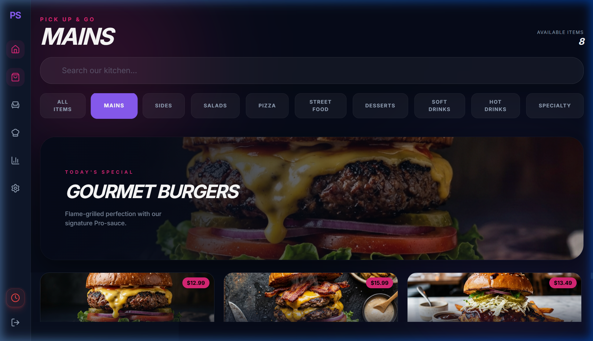
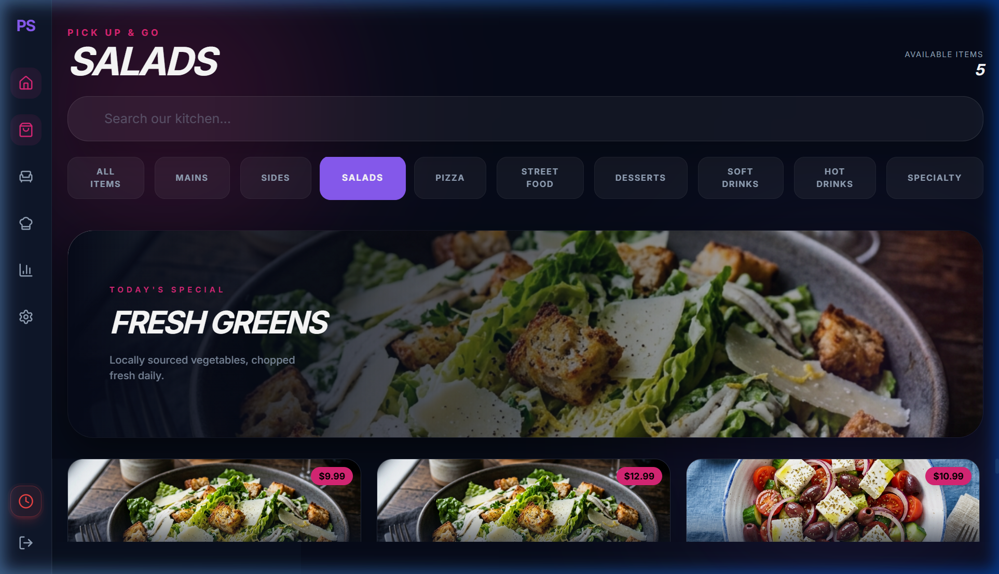
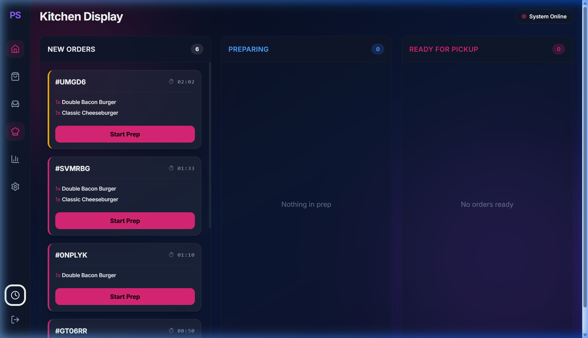
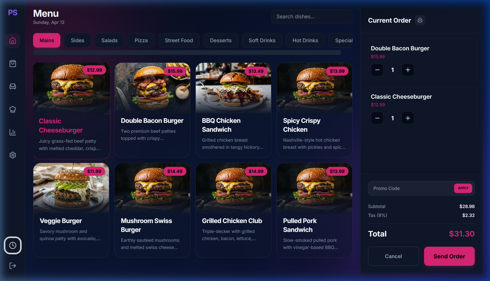

  <h1>🔥 ProServe POS</h1>
  
<strong>Smart restaurant operations, simplified.</strong>

  

    <a href="#live-demo">[ Live Demo ]</a>
    <a href="#view-code">[ View Code ]</a>
  

---

## 💡 Running a restaurant is chaotic.

Orders get lost. Kitchens get overwhelmed. Staff waste time.

**ProServe solves this** with a fast, modern POS system designed for real workflows. This isn't just a static demo; it's a multi-screen ecosystem built with real-time UI states.

---

## ⚡ Features

* **⚡ Real-time order flow**: Order items from the front and watch them sync live to the kitchen via Zustand state.
* **🍳 Kitchen Display System (KDS)**: Time-based visual ticker tracking orders. Red visual indicators for overdue tickets.
* **🪑 Table Management**: Interactive restaurant map visualization for tracking seated, available, and checking-out tables.
* **💳 Smart checkout**: Dynamic calculation of totals and taxes, directly firing receipts and status updates.
* **⌨️ Speed mode shortcuts**: Native keyboard listening for blazing fast POS item entry and ticket passing.

---

## 🎥 ProServe in Action

### 🛒 Premium Takeout Experience
Experience a lightning-fast, full-bleed menu with unique high-definition food photography for every main dish and salad.

*Gourmet Mains with Dynamic Hero Banners*

*Fresh Greens & Artisanal Salad Imagery*

---

### 🍳 Enterprise Kitchen Flow
Real-time synchronization between the front-of-house and the kitchen display.

*Live Order Ticker with Time Tracking & Status Sync*

---

### 💻 Professional POS Interface
Staff-centric controls with secure shift management and advanced order logic.

*Secure Staff Clock-In & Advanced Order Panel*

---

## ⚡ Key Features

*   **⚡ Real-time Order Flow**: Instant sync between POS, Takeout, and KDS via Zustand.
*   **🕒 Staff Management**: Integrated **Shift Logic (Clock In/Out)** for operational security.
*   **🚫 Void Engine**: Professional item voiding with strikethrough logic (manager-ready).
*   **🏷️ Promo Engine**: Dynamic discount codes (`PROSERVE10`, `ELITE20`) with live total updates.
*   **🧾 Print Engine**: Professional receipt generation with clean `@media print` layouts.
*   **🍳 Smart KDS**: Visual urgency indicators for kitchen staff.

---

## 🧠 Tech Stack

**Frontend:** React · Vite · Tailwind CSS V4 · Framer Motion
**State:** Zustand (Global Store)
**Icons:** Lucide-React

---

## 🚀 Get Started

1. **Clone the repo**
2. **Install deps**: `npm install`
3. **Launch**: `npm run dev`

